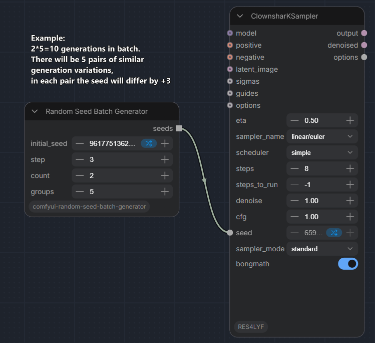

# Random Seed Batch Generator

Generate multiple groups of seeds for batch image processing. Each group produces similar variations by incrementing seeds with a fixed step. Use multiple groups to run several independent variation sets in a single execution.

**Usage:** Connect the `seeds` output to the `seed` input of any sampler node (e.g., KSampler, KSampler Advanced).

## Inputs

| Parameter | Type | Default | Description |
|-----------|------|---------|-------------|
| `initial_seed` | INT | 0 | Starting seed for reproducible randomization. When set, the same initial_seed + control_after_generate will produce the same sequence of seeds. |
| `control_after_generate` | - | randomize | Controls how `initial_seed` changes after each execution: `fixed`, `increment`, `decrement`, or `randomize`. |
| `step` | INT | 1 | Step between seeds within a single group. Set to 0 for all seeds in a group to be equal. |
| `count` | INT | 1 | Number of seeds per group. |
| `groups` | INT | 1 | Number of groups to generate. Each group starts from a random seed. |

## Outputs

| Output | Type | Description |
|--------|------|-------------|
| `seeds` | INT (list) | Flat list of all generated seeds. Total count = `count * groups`. |

## How It Works

1. A deterministic RNG is seeded with `initial_seed` using `random.Random(initial_seed)`.
2. For each group, a random starting seed is generated from this RNG in range `0..max_start`.
3. Seeds within a group are calculated as: `start + step + i` for `i` in `0..count-1`.
4. The starting seed is constrained so that all seeds in the group stay within the valid range `0..2^64-1`.
5. All groups are concatenated into a single flat list.
6. After execution, `initial_seed` is updated according to `control_after_generate`: `fixed` (no change), `increment` (+1), `decrement` (-1), or `randomize` (new random value).

## Example



With `step=3`, `count=2`, `groups=5`, the output will be 10 generations in batch:
- 5 pairs of similar generation variations
- In each pair the seed will differ by +3

With `step=3`, `count=2`, `groups=5`, the output might look like:

```
[12345, 12348, 67890, 67893, 11111, 11114, 22222, 22225, 33333, 33336]
```

Where:
- Group 1: `[12345, 12348]` (start=12345, step=3)
- Group 2: `[67890, 67893]` (start=67890, step=3)
- Group 3: `[11111, 11114]` (start=11111, step=3)
- Group 4: `[22222, 22225]` (start=22222, step=3)
- Group 5: `[33333, 33336]` (start=33333, step=3)

> **Note:** Values are random and will differ on each execution.

## Use Cases

- Generate similar image variations by using seeds with a small step.
- Run multiple independent variation sets in a single ComfyUI execution.
- Control how many generations to create within one workflow run.

## Important Notes

- **Reproducible with `initial_seed`:** When `initial_seed` is set and `control_after_generate` is `fixed` or `increment`/`decrement`, the same sequence of seeds will be produced across executions.
- All seeds are guaranteed to be in range `0..2^64-1`.
- If `step + count - 1 > 2^64-1`, the output will be empty (no valid seeds can be generated).
- Total output size = `count * groups`. Be careful with very large values (e.g., `count=1000, groups=1000` produces 1,000,000 seeds).
- **Batch size:** The number of generated seeds (`count * groups`) determines the batch size when connected to KSampler. Make sure your KSampler batch_size matches or is compatible with this count.
- **Empty output:** If parameters are invalid (e.g., `step + count - 1 > 2^64-1`), the node returns an empty list, which may cause downstream errors.

## License

This project is licensed under the GNU General Public License v3.0 (GPL-3.0). See [LICENSE.txt](LICENSE.txt) for the full text.

Based on [Seed Shifter](https://github.com/Steudio/ComfyUI_Steudio) from [comfyui_steudio](https://github.com/Steudio) by Steudio, also licensed under GPL-3.0.

## Links

- Repository: https://github.com/Glashkoff/comfyui-random-seed-batch-generator
